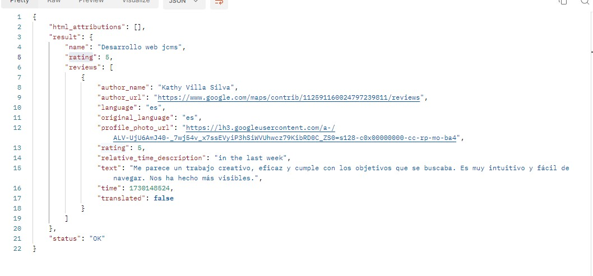

# reviews_google 
proyecto para mostrar las reseñas en Google mapa de los usuarios.
- desarrollado en php
- uso de api de google map

Antees de comenzar debemos saber el id particular del comercio para ello debemos ir:
[Buscar id comercio](https://developers.google.com/maps/documentation/places/web-service/place-id?hl=es-419#places-api)

Me he buscado, ese es el resultado.
mi 'place_id' es 'ChIJxQQ8oG0nQg0Rg-0sKaNugIc'.
No es necesario buscarlo ya que hay otra api que podemos implementar y nos devuelva el place_id. Eso sera en otro momento.
una vez que lo tenemos, necesitaremos nuestro 'API_KEY' que nos los proporciona desde nuestro panel de Google.
Ahora solo nos queda montar la url con estos dos datos:
- place_id = ChIJxQQ8oG0nQg0Rg-0sKaNugIc
- key = YOUR_API_KEY
Y quedaría así:
 https://maps.googleapis.com/maps/api/place/details/json?place_id=ChIJrTLr-GyuEmsRBfy61i59si0&key=YOUR_API_KEY

 Con esto nos devolvera un json si todo esta correcto, similar:
 

 Ya solo nos quedaría procesar el json para mostrar la información que  queremos.
 En mi caso voy a utilizar php, pero podemos hacer la petición en el lenguaje que más nos guste.

 Solo tengo una reseña, pero puede ver como funciona en mi personal page.

 Si te gusto dale una estrella y puede invitarme a un café.

O dejarme una reseña en:
[Deja tu reseña](https://g.page/r/CYPtLCmjboCHEAE/review)

